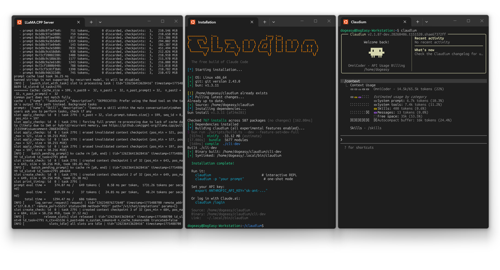

# Claudium

All Anthropic OAuth stripped. All telemetry stripped. All injected security-prompt guardrails removed. All experimental features unlocked. One binary, zero callbacks home.

### Stable (main branch)

```bash
curl -fsSL https://raw.githubusercontent.com/DdogezD/claudium/main/install.sh | bash
```

> Checks your system, installs Bun if needed, clones, builds with all features enabled, installs `claudium`, and creates a `claudium-bypass` launcher that starts in bypass permission mode. See [API Configuration](#api-configuration) for API setup.

### Dev (bleeding edge)

```bash
curl -fsSL https://raw.githubusercontent.com/DdogezD/claudium/main/install_dev.sh | bash
```

> Installs from the `dev` branch as `claudium` (and `claudium-bypass`). Same binary names as the stable installer — only the source branch differs.

<p align="center">
  
</p>

---

## What is this

This is a clean, buildable fork of Anthropic's [Claude Code](https://docs.anthropic.com/en/docs/claude-code) CLI -- the terminal-native AI coding agent. The upstream source became publicly available on March 31, 2026 through a source map exposure in the npm distribution.

This fork applies six categories of changes on top of that snapshot:

### 1. Privacy-First

Eliminates all tracking and remote-control mechanisms present in the original Claude Code:

- No telemetry -- No unnecessary data is transmitted to Anthropic servers
- No analytics -- No usage tracking or event logging
- No fingerprinting -- No user or environment identification
- No auto-updates -- No remote version control or forced updates

### 2. OAuth and Cloud Services Stripped

Unlike the upstream Claude Code, Claudium has no OAuth login, no claude.ai remote sessions, and no cloud provider integration:

- No `/login` command -- authenticating with claude.ai OAuth is removed
- No remote CCR sessions -- all bridge/remote session code is stripped
- No GrowthBook server-side feature flag dependency
- No auto-update infrastructure
- No settings sync to/from cloud

All authentication is done via API keys (see [API Configuration](#api-configuration)).

### 3. OpenAI-compatible API support

Added an API shim layer (`src/services/api/openaiShim.ts`) that transparently translates between Anthropic message format and OpenAI-compatible APIs. It supports both Chat Completions and the newer Responses API, so all Claudium tools (bash, file read/write, grep, glob, agents, MCP, etc.) keep working while you swap in a different backend LLM.

### 4. SearXNG-backed WebSearch

Added an optional override for the built-in `WebSearch` tool so it can query your own SearXNG instance instead of relying on provider-side web search.

- Configured with one env var: `CLAUDE_CODE_SEARXNG_BASE_URL`
- Keeps the existing `WebSearch` tool contract and UI intact
- Preserves `allowed_domains` / `blocked_domains` semantics with local filtering
- Falls back to the default provider behavior when the env var is unset

### 5. Security-prompt guardrails removed

Anthropic injects system-level instructions into every conversation that constrain Claude's behavior beyond what the model itself enforces. These include:

- Hardcoded refusal patterns for certain categories of prompts
- Injected "cyber risk" instruction blocks
- Managed-settings security overlays pushed from Anthropic's servers

This build strips those injections. The model's own safety training still applies -- this just removes the extra layer of prompt-level restrictions that the CLI wraps around it.

### 6. Experimental features enabled

Claude Code ships with dozens of feature flags gated behind `bun:bundle` compile-time switches. Most are disabled in the public npm release. This build unlocks all 45+ flags that compile cleanly, including:

| Feature | What it does |
|---|---|
| `ULTRAPLAN` | Remote multi-agent planning on Claude Code web (Opus-class) |
| `ULTRATHINK` | Deep thinking mode -- type "ultrathink" to boost reasoning effort |
| `VOICE_MODE` | Push-to-talk voice input and dictation |
| `AGENT_TRIGGERS` | Local cron/trigger tools for background automation |
| `BRIDGE_MODE` | IDE remote-control bridge (VS Code, JetBrains) |
| `TOKEN_BUDGET` | Token budget tracking and usage warnings |
| `BUILTIN_EXPLORE_PLAN_AGENTS` | Built-in explore/plan agent presets |
| `VERIFICATION_AGENT` | Verification agent for task validation |
| `BASH_CLASSIFIER` | Classifier-assisted bash permission decisions |
| `EXTRACT_MEMORIES` | Post-query automatic memory extraction |
| `HISTORY_PICKER` | Interactive prompt history picker |
| `MESSAGE_ACTIONS` | Message action entrypoints in the UI |
| `QUICK_SEARCH` | Prompt quick-search |
| `SHOT_STATS` | Shot-distribution stats |
| `COMPACTION_REMINDERS` | Smart reminders around context compaction |
| `CACHED_MICROCOMPACT` | Cached microcompact state through query flows |

See [FEATURES.md](FEATURES.md) for the full audit of all 88 flags and their status.

---

## Quick install

```bash
curl -fsSL https://raw.githubusercontent.com/DdogezD/claudium/main/install.sh | bash
```

This will check your system, install Bun if needed, clone the repo, build the binary `claudium-cli-dev` (with all experimental features enabled), install it as `claudium`, and create a `claudium-bypass` launcher in `~/.local/bin`.

---

## Requirements

- [Bun](https://bun.sh) >= 1.3.11
- macOS or Linux (Windows via WSL)
- An API key ([Anthropic Messages](#anthropic-messages-api) or [OpenAI-compatible APIs](#openai-compatible-apis))

```bash
# Install Bun if you don't have it
curl -fsSL https://bun.sh/install | bash
```

---

## Build

```bash
# Clone the repo
git clone https://github.com/DdogezD/claudium.git
cd claudium

# Install dependencies
bun install

# Standard build -- produces ./claudium-cli
bun run build

# Dev build -- dev version stamp, experimental GrowthBook key
bun run build:dev

# Dev build with ALL experimental features enabled -- produces ./claudium-cli-dev
bun run build:dev:full

# Compiled build (alternative output path) -- produces ./dist/claudium-cli
bun run compile
```

### Build variants

| Command | Output | Features | Notes |
|---|---|---|---|
| `bun run build` | `./claudium-cli` | `VOICE_MODE` only | Production-like binary |
| `bun run build:dev` | `./claudium-cli-dev` | `VOICE_MODE` only | Dev version stamp |
| `bun run build:dev:full` | `./claudium-cli-dev` | All 45+ experimental flags | The full unlock build |
| `bun run compile` | `./dist/claudium-cli` | `VOICE_MODE` only | Alternative output directory |

### Individual feature flags

You can enable specific flags without the full bundle:

```bash
# Enable just ultraplan and ultrathink
bun run ./scripts/build.ts --feature=ULTRAPLAN --feature=ULTRATHINK

# Enable a specific flag on top of the dev build
bun run ./scripts/build.ts --dev --feature=BRIDGE_MODE
```

---

## Run

```bash
# Run the installed binary
claudium

# Run the installed binary in bypass permission mode
claudium-bypass

# Or the built binary
./claudium-cli

# Or the dev binary
./claudium-cli-dev

# Or run from source without compiling (slower startup)
bun run dev

# See [API Configuration](#api-configuration) for API setup.
```

`claudium-bypass` is installed by `install.sh`. It exports `IS_SANDBOX=1` and runs the installed `claudium` binary with `--permission-mode bypassPermissions`.

### Quick test

```bash
# One-shot mode
claudium -p "what files are in this directory?"

# One-shot mode with bypass permission mode enabled
claudium-bypass -p "scan this repo and summarize risky scripts"

# Interactive REPL (default)
claudium

# Interactive REPL (bypassPermissions)
claudium-bypass

# With specific model
claudium --model claude-sonnet-4-6-20250514

# Set advisor model
claudium --advisor-model claude-sonnet-4-6-20250514
```

## Advisor Tool

Claudium includes a built-in **Advisor** tool that runs a stronger reviewer model
to audit your approach before you commit to implementation. The advisor checks for
architecture flaws, security issues, edge cases, and correctness.

- Configured via `CLAUDE_CODE_ADVISOR_MODEL` or the `/advisor <model>` slash command
- Provider-agnostic — works with any model, including OpenAI-compatible backends
- Automatically called by the executor model on the first significant action of each task
- Also available for manual review: call the `Advisor` tool with your question

```bash
# Enable via env var
export CLAUDE_CODE_ADVISOR_MODEL="claude-opus-4-6"

# Enable via slash command (interactive session)
/advisor claude-opus-4-6

# Disable
/advisor off
```

---

## Project structure

```
scripts/
  build.ts              # Build script with feature flag system

src/
  entrypoints/cli.tsx   # CLI entrypoint
  commands.ts           # Command registry (slash commands)
  tools.ts              # Tool registry (agent tools)
  QueryEngine.ts        # LLM query engine
  screens/REPL.tsx      # Main interactive UI

  commands/             # /slash command implementations
  tools/                # Agent tool implementations (Bash, Read, Edit, etc.)
  components/           # Ink/React terminal UI components
  hooks/                # React hooks
  services/             # API client, MCP, analytics
  state/                # App state store
  utils/                # Utilities
  skills/               # Skill system
  plugins/              # Plugin system
  bridge/               # IDE bridge
  voice/                # Voice input
  tasks/                # Background task management
```

---

## Tech stack

| | |
|---|---|
| Runtime | [Bun](https://bun.sh) |
| Language | TypeScript |
| Terminal UI | React + [Ink](https://github.com/vadimdemedes/ink) |
| CLI parsing | [Commander.js](https://github.com/tj/commander.js) |
| Schema validation | Zod v4 |
| Code search | ripgrep (bundled) |
| Protocols | MCP, LSP |
| API | Anthropic Messages API / OpenAI-compatible APIs |

---

## API Configuration

Claudium supports both **Anthropic Messages API** (natively) and **OpenAI-compatible APIs**. The shim can use either Chat Completions or the newer Responses API depending on the provider and model you configure.

Note: Unlike the upstream Claude Code, Claudium does **not** support OAuth login via claude.ai. All authentication is done via API keys.

### Anthropic Messages API

Use the official Anthropic Messages API with your Anthropic API key.

```bash
export ANTHROPIC_API_KEY="sk-ant-..."
```

### OpenAI-compatible APIs

Enable OpenAI-compatible mode and configure your preferred provider:

```bash
export CLAUDE_CODE_USE_OPENAI=1
```

#### Environment Variables

| Variable | Description |
|---|---|
| `OPENAI_API_KEY` | API key (required for cloud APIs, optional for local models) |
| `OPENAI_BASE_URL` | API base URL (default: `https://api.openai.com/v1`) |
| `OPENAI_MODEL` | Explicit model ID for the OpenAI-compatible provider |
| `OPENAI_API_MODE` | Force transport selection: `chat_completions` or `responses` |
| `CLAUDE_CODE_MAX_CONTEXT_TOKENS` | Override max context window size |
| `CLAUDE_CODE_SUMMARY_OUTPUT_TOKENS` | Override token limit for summarized context |
| `CLAUDE_CODE_AUTO_COMPACT_BUFFER_TOKENS` | Override auto-compact buffer size |
| `CLAUDE_CODE_ADVISOR_MODEL` | Set the advisor/reviewer model (provider-agnostic) |
| `CLAUDE_CODE_SUBAGENT_MAX_CONTEXT_TOKENS` | Override max context window size for subagents |
| `CLAUDE_CODE_SUBAGENT_BUFFER_TOKENS` | Override auto-compact buffer size for subagents |
| `CLAUDE_CODE_SUBAGENT_SUMMARY_OUTPUT_TOKENS` | Override summary output token reservation for subagents |
| `CLAUDE_CODE_ADVISOR_MAX_CONTEXT_TOKENS` | Override max context window size for the advisor tool |
| `CLAUDE_CODE_ADVISOR_BUFFER_TOKENS` | Override auto-compact buffer size for the advisor tool |
| `CLAUDE_CODE_ADVISOR_SUMMARY_OUTPUT_TOKENS` | Override summary output token reservation for the advisor tool |

**Autocompact buffer** = `CLAUDE_CODE_SUMMARY_OUTPUT_TOKENS` + `CLAUDE_CODE_AUTO_COMPACT_BUFFER_TOKENS`

#### Subagent & Advisor Context Configuration

Subagents (spawned via the `Agent` tool) and the `Advisor` tool each run their own
query loops with independent context management. By default they inherit the same
context window, auto-compact buffer, and summary output reservation as the main
agent. You can override these independently using env vars or `settings.json`.

**Env vars (highest priority):**
```bash
# Subagent overrides
export CLAUDE_CODE_SUBAGENT_MAX_CONTEXT_TOKENS=100000
export CLAUDE_CODE_SUBAGENT_BUFFER_TOKENS=5000
export CLAUDE_CODE_SUBAGENT_SUMMARY_OUTPUT_TOKENS=8000

# Advisor overrides
export CLAUDE_CODE_ADVISOR_MAX_CONTEXT_TOKENS=150000
export CLAUDE_CODE_ADVISOR_BUFFER_TOKENS=10000
export CLAUDE_CODE_ADVISOR_SUMMARY_OUTPUT_TOKENS=16000
```

**settings.json (persistent config):**
```json
{
  "subagentContextWindow": 100000,
  "subagentBufferTokens": 5000,
  "subagentSummaryOutputTokens": 8000,
  "advisorContextWindow": 150000,
  "advisorBufferTokens": 10000,
  "advisorSummaryOutputTokens": 16000
}
```

**Priority chain** (each parameter independently):
1. context-specific env var (e.g. `CLAUDE_CODE_SUBAGENT_MAX_CONTEXT_TOKENS`)
2. context-specific `settings.json` field (e.g. `subagentContextWindow`)
3. general env var (e.g. `CLAUDE_CODE_MAX_CONTEXT_TOKENS`)
4. model default

Context window overrides use `min()` semantics — they only cap downward, never
expand beyond what the model supports.

**Calculation reminder:**
```
effectiveWindow = min(modelContextWindow, contextWindowOverride, AUTO_COMPACT_WINDOW)
                   - summaryOutputTokens
compactThreshold = effectiveWindow - bufferTokens
totalBuffer       = summaryOutputTokens + bufferTokens  (default: 20000 + 13000 = 33000)
```

Configure an explicit model for every provider: use `OPENAI_MODEL` for OpenAI-compatible mode, `ANTHROPIC_MODEL` for other providers, or set `modelProfiles.main.model` in `settings.json`. There is no built-in model default and model family aliases such as `opus`, `sonnet`, and `haiku` are not supported. `modelOverrides` maps exact canonical model IDs to provider-specific deployment IDs.

#### Transport selection

- Codex aliases such as `codexplan` and `codexspark` also use the unified Responses transport, but through the ChatGPT Codex auth/backend path.
- Other OpenAI-compatible backends stay on Chat Completions by default for maximum compatibility unless you explicitly select Responses.
- Official OpenAI requests that include reasoning still use the Responses API.
- Set `OPENAI_API_MODE=responses` to force `/responses` on providers that support it, or `OPENAI_API_MODE=chat_completions` to force the legacy path.

#### Provider Examples

**OpenAI (Responses API, explicit):**
```bash
export CLAUDE_CODE_USE_OPENAI=1
export OPENAI_API_KEY=sk-...
export OPENAI_MODEL=gpt-5.4
export OPENAI_API_MODE=responses
```

**OpenAI ChatGPT:**
```bash
export CLAUDE_CODE_USE_OPENAI=1
export OPENAI_API_KEY=sk-...
export OPENAI_MODEL=gpt-4o
export OPENAI_API_MODE=chat_completions
```

**OpenAI ChatGPT Codex:**
```bash
export CLAUDE_CODE_USE_OPENAI=1
export CODEX_API_KEY=eyJ...
export CHATGPT_ACCOUNT_ID=account_...
export OPENAI_MODEL=codexplan
```

**OpenRouter:**
```bash
export CLAUDE_CODE_USE_OPENAI=1
export OPENAI_API_KEY=sk-or-v1-...
export OPENAI_BASE_URL=https://openrouter.ai/api/v1
export OPENAI_MODEL=openai/gpt-5.4
```

**DeepSeek:**
```bash
export CLAUDE_CODE_USE_OPENAI=1
export OPENAI_API_KEY=sk-...
export OPENAI_BASE_URL=https://api.deepseek.com/v1
export OPENAI_MODEL=deepseek-chat
```

**LLaMA.CPP (local):**
```bash
export CLAUDE_CODE_USE_OPENAI=1
export OPENAI_BASE_URL=http://localhost:1234/v1
export OPENAI_MODEL=your-model-name
export CLAUDE_CODE_MAX_CONTEXT_TOKENS=65536
export CLAUDE_CODE_SUMMARY_OUTPUT_TOKENS=12000
export CLAUDE_CODE_AUTO_COMPACT_BUFFER_TOKENS=4000
```

**Ollama (local):**
```bash
export CLAUDE_CODE_USE_OPENAI=1
export OPENAI_BASE_URL=http://localhost:1234/v1
export OPENAI_MODEL=llama3.3
```

**LM Studio (local):**
```bash
export CLAUDE_CODE_USE_OPENAI=1
export OPENAI_BASE_URL=http://localhost:1234/v1
export OPENAI_MODEL=your-model-name
```

**Azure OpenAI:**
```bash
export CLAUDE_CODE_USE_OPENAI=1
export OPENAI_API_KEY=your-azure-key
export OPENAI_BASE_URL=https://your-resource.openai.azure.com/openai/deployments/your-deployment
export OPENAI_MODEL=gpt-4o
export AZURE_OPENAI_API_VERSION=2024-12-01-preview
```

### SearXNG-backed WebSearch

You can route Claudium's built-in `WebSearch` tool through your own SearXNG instance by setting one environment variable:

```bash
export CLAUDE_CODE_SEARXNG_BASE_URL=http://localhost:8888/
```

When this variable is set, `WebSearch` no longer relies on the provider's server-side web search. Instead, Claudium calls your SearXNG instance directly at:

```text
GET {CLAUDE_CODE_SEARXNG_BASE_URL}/search?q=<query>&format=json
```

Notes:

- This only changes the `WebSearch` tool. `WebFetch` still fetches page content directly.
- `allowed_domains` and `blocked_domains` are still supported, but filtering is applied locally after SearXNG returns results.
- If `CLAUDE_CODE_SEARXNG_BASE_URL` is unset, Claudium falls back to the default provider behavior.

---

## License

The original Claude Code source is the property of Anthropic. This fork exists because the source was publicly exposed through their npm distribution. Use at your own discretion.
